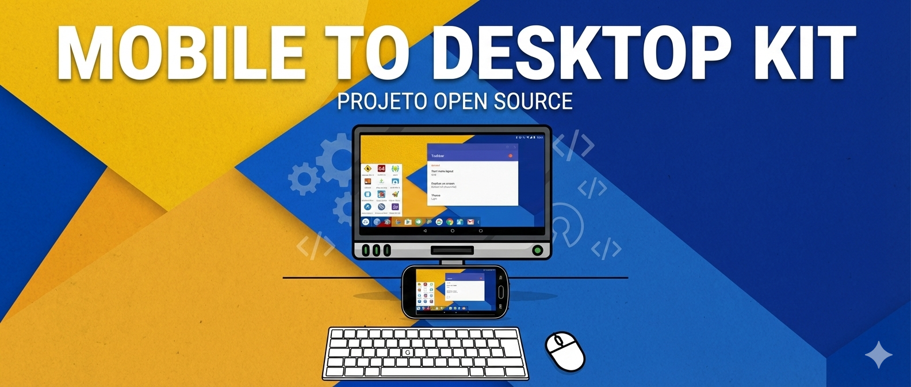

# 📱💻 Mobile to Desktop Kit

## Transforme seu celular em um PC — Wireless First

Projeto open-source que ensina como transformar **um celular em um computador funcional**, priorizando **espelhamento sem fio**, **baixo custo**, **alta compatibilidade** e **mínima taxa de falha**.

---

## 🎯 Objetivo

Levar acesso à computação básica para pessoas que:
- não possuem computador
- possuem apenas um celular
- precisam estudar, trabalhar ou acessar sistemas web

Tudo isso **sem depender de marcas, cabos especiais ou hardware caro**.

---

## 🧠 Princípios

- Wireless é o padrão
- Cabo é opcional
- Compatibilidade vem antes de performance
- Funcionar para a maioria é mais importante que funcionar para poucos

---

## 🧩 O que este projeto entrega

✔ Uso do celular como computador básico  
✔ Interface tipo desktop  
✔ Uso com teclado e mouse  
✔ Espelhamento em TV ou monitor  
✔ Custo extremamente acessível  

---

## 💸 Custo médio

Entre **R$ 60 e R$ 180**, dependendo do que a pessoa já possui.

---

## 📘 Documentação

- [Checklist oficial](./docs/01-visao-geral-do-kit.md) → `docs/02-checklist-oficial.md`
- [Guia passo a passo](./docs/03-configuracao-passo-a-passo.md) → `docs/03-configuracao-passo-a-passo.md`
- [Versão PDF](./assets/pdf/mobile-to-desktop-kit.pdf) → `assets/pdf/mobile-to-desktop-kit.pdf`
- [Manifesto](MANIFESTO.md) → `MANIFESTO.md`

---

## 📚 Documentação Complementar

- 🛡️ Guia de Sobrevivência: [Primeiros passos após conectar](./docs/guia-sobrevivencia.md)
- 🚀 [Lista de Apps Recomendados para Desktop](./docs/lista-apps.md)
- 💰 Guia de Compras: [Como gastar pouco em teclado e mouse](./docs/hardware-barato.md)
- 🎧 [Guia em aúdio:](https://www.youtube.com/watch?v=0I2bjauwszQ)
- 📽️ [Guia em vídeo:](https://www.youtube.com/watch?v=5EKiciBNJrs)

## 🤝 Contribuições

Este projeto é aberto a contribuições.  
Veja `contrib/como-contribuir.md`.

---

## 🏛️ Para Instituições e Comunidades

- 📄 [Carta de Proposta para Instituições](./docs/proposta-institucional.md)

---

## 📜 Licença

MIT License.

